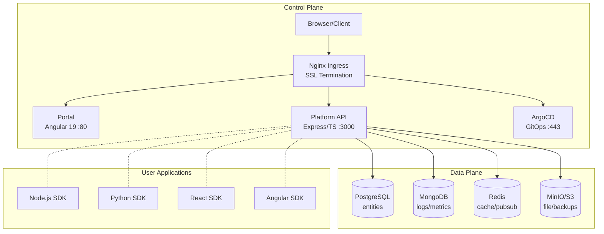
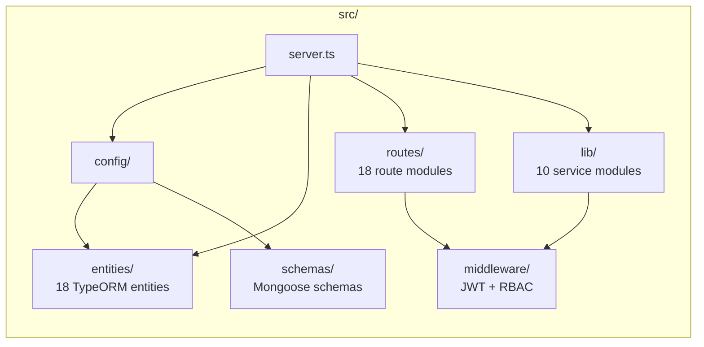
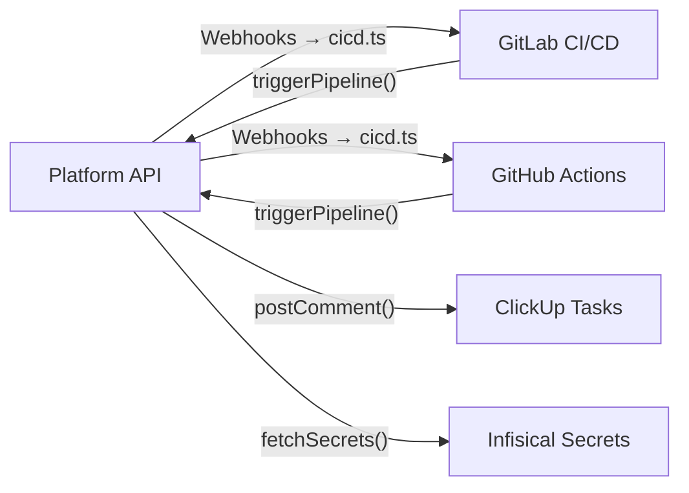

# Architecture Overview

## System Architecture

## Component Overview

  

    
⚡

    <h4>Platform API</h4>
  

  
<strong>Express 4 + TypeScript + TypeORM + Mongoose</strong> — REST backend handling auth, CRUD, secrets, deployments, SDK endpoints, and audit logging. Connects to PostgreSQL for relational data and MongoDB for time-series/logs.

  

    
🖥️

    <h4>Portal</h4>
  

  
<strong>Angular 19 + Tailwind + Standalone Components</strong> — Web UI providing dashboards, project management, secret editor, and OAuth consent screens. Thin client with no direct data store.

  

    
🗄️

    <h4>PostgreSQL 16</h4>
  

  
<strong>Primary data store</strong> — Users, projects, secrets, roles, deployments, and audit logs. Synchronized via TypeORM with <code>synchronize: true</code>. Persistent volume.

  

    
📊

    <h4>MongoDB 7.x</h4>
  

  
<strong>Time-series & unstructured data</strong> — Logs, API metrics, bug reports, SDK events, and raw metrics. Non-blocking Mongoose connection. Persistent volume.

  

    
⚡

    <h4>Redis 7</h4>
  

  
<strong>In-memory cache + pub/sub</strong> — Permission cache (60s TTL), session store, pub/sub for real-time events. Ephemeral with optional AOF persistence.

  

    
📦

    <h4>MinIO / S3</h4>
  

  
<strong>Object storage</strong> — File uploads, database backups, bug report screenshots, and SDK artifacts. S3-compatible API. Persistent volume.

## API Server Structure

| Directory | Contents |
|-----------|----------|
| `server.ts` | Bootstrap — init DB, seed, mount routes, listen |
| `config/` | Database (TypeORM), Mongoose, connections (pg/Redis/Mongo), permissions (5 preset roles), K8s client wrappers, init/shutdown |
| `entities/` | 18 TypeORM entities — User, Role, Project, Environment, Deployment, Secret, SecretVersion, ServiceRegistration, SdkCredential, AuditLog, ClickupTaskLink, DbConnection, DbBackup, File, StorageProvider, Alert, SmtpConfig, ProjectConfig |
| `routes/` | 18 route modules — auth, sdk, secrets, deployments, projects, webhooks, cicd, metrics, bug-reports, db-provision, db-connections, storage, alerts, config, bootstrap, audit-logs, settings |
| `lib/` | 10 service modules — secrets-encryption (AES-256-GCM), gitlab, clickup, infisical, k8s, lokilog, database-service, preview, preview-decay (72h TTL), storage-service, smtp-service |
| `middleware/` | JWT verify, RBAC, permission cache (60s TTL), SDK token auth |
| `schemas/` | Mongoose schemas — Log, ApiMetric, MetricsRaw, BugReport, ErrorDoc, SdkEvent, FeatureFlag, MetricsHourly |

## Multi-SDK Architecture

Four SDKs automatically register with the API, send heartbeats, capture metrics/logs, and submit bug reports:

```mermaid
graph TB
    API["Platform API"]
    subgraph Endpoints["SDK Endpoints"]
        Register["POST /api/sdk/register"]
        Heartbeat["POST /api/sdk/heartbeat"]
        Logs["POST /api/sdk/logs"]
        Metrics["POST /api/sdk/api-metrics"]
        BugReport["POST /api/sdk/bug-report"]
        Config["GET /api/sdk/config"]
        DBCreds["GET /api/sdk/db-credentials"]
    end
    subgraph SDKs["SDKs"]
        Node["Node.js SDK<br/><code>&#64;mpratyush54/sdk-node</code>"]
        Python["Python SDK<br/><code>platform-sdk-python</code>"]
        React["React SDK<br/><code>&#64;mpratyush54/sdk-react</code>"]
        Angular["Angular SDK<br/><code>&#64;mpratyush54/sdk-angular</code>"]
    end
    API --> Register
    API --> Heartbeat
    API --> Logs
    API --> Metrics
    API --> BugReport
    API --> Config
    API --> DBCreds
    Register -.-> Node
    Register -.-> Python
    Register -.-> React
    Register -.-> Angular
    Heartbeat -.-> Node
    Heartbeat -.-> Python
    Heartbeat -.-> React
    Heartbeat -.-> Angular
    Logs -.-> Node
    Logs -.-> Python
    Metrics -.-> Node
    Metrics -.-> React
    Metrics -.-> Angular
    BugReport -.-> Node
    BugReport -.-> React
    BugReport -.-> Angular
    Config -.-> Node
    Config -.-> Python
    Config -.-> React
    Config -.-> Angular
    DBCreds -.-> Node
    DBCreds -.-> Python
```

  

    
🟢

    <h4>Node.js SDK — <code>@mpratyush54/sdk-node</code></h4>
  

  
<strong>Auth:</strong> <code>sdk-{projectId}:{secret}</code> or <code>sdk_live_{uuid}</code>. <strong>Key feature:</strong> <code>PlatformClient.init()</code> auto-registers, sends heartbeats, provides Express metrics middleware, captures console logs, Winston/Pino transports, and database managers (pg, mongo, redis).

  

    
🔵

    <h4>Python SDK — <code>platform-sdk-python</code></h4>
  

  
<strong>Auth:</strong> SDK token. <strong>Key feature:</strong> <code>PlatformClient()</code> provides registration, metrics reporting, logging, and config fetching.

  

    
⚛️

    <h4>React SDK — <code>@mpratyush54/sdk-react</code></h4>
  

  
<strong>Auth:</strong> SDK token. <strong>Key feature:</strong> <code>&lt;PlatformProvider&gt;</code> wraps your app with hook-based API access, <code>&lt;ErrorBoundary&gt;</code> for crash interception, <code>&lt;BugReporterWidget&gt;</code>, <code>usePlatform()</code>, and <code>useBugReporter()</code> hooks.

  

    
🅰️

    <h4>Angular SDK — <code>@mpratyush54/sdk-angular</code></h4>
  

  
<strong>Auth:</strong> SDK token. <strong>Key feature:</strong> <code>PlatformModule</code> provides an HTTP interceptor for metrics, <code>ErrorHandler</code> for global error capture, and <code>BugReporterComponent</code> for user feedback.

## External Integrations

### GitLab / GitHub CI/CD

- **Webhook receiver:** `POST /api/webhooks/gitlab` / `POST /api/webhooks/github`
- Validates `X-Gitlab-Token` / `X-Hub-Signature`, extracts branch, commit SHA, project
- Creates/updates preview environments per branch, deploys to k3s
- Posts ClickUp comments with preview URLs
- **Pipeline trigger:** `triggerPipeline(projectId, branch)` fires GitLab pipeline via API token

### ClickUp

- **Bug report → task:** When an SDK submits a bug report, if the project has `clickupListId`, a task is created automatically
- **Preview env notification:** `formatPreviewComment()` generates formatted comment with branch, URL, and expiry
- **Task extraction:** `extractTaskId(branch)` parses `CU-12345` from branch name

### Infisical

- **Fallback secret sync:** `fetchSecrets(projectId, environment)` reads from Platform's own Secret entity (AES-256-GCM), returns plaintext map
- Used by SDK config endpoint (`GET /api/sdk/config`) and DB credentials endpoint (`GET /api/sdk/db-credentials`)

## Key Design Decisions

### #1 Password-less Authentication

`POST /api/auth/login` accepts **only email** — no password. If the email exists in the `users` table, a JWT is issued immediately. Rationale: Simplifies auth for internal PaaS; relies on network-level security (ingress TLS, mTLS for production). Demo seeding creates 4 users on first boot.

### #2 JWT-based Sessions

Tokens are signed with `JWT_SECRET` (default: `plat-super-secret-key`). Expiry: **24 hours** for login JWT, **1 hour** for OIDC access tokens. Payload: `{ id, email, name, role }` — no password hash needed. The `expressAuthenticate` middleware verifies the JWT on every protected route and attaches `req.user`.

### #3 RBAC with Cached Permissions

`ROLE_PRESETS` defines 5 roles (admin, devops, tech_lead, developer, viewer). An **in-memory cache** (`Map<userId, { permissions, expiresAt }>`) with 60s TTL avoids Redis latency. `clearPermissionCache(userId?)` is called on role mutation. `requirePermission(...permissions)` resolves user permissions and checks all required perms.

### #4 Dual-Database Strategy

**PostgreSQL** (TypeORM) handles ACID-compliant relational data — users, projects, secrets, deployments, roles, audit logs. **MongoDB** (Mongoose) handles high-volume write throughput for time-series data — logs, API metrics, raw metrics, bug reports, SDK events. PostgreSQL is synchronized via `synchronize: true`; MongoDB connects non-blocking.

### #5 In-Memory Permission Cache over Redis

Permissions are cached in a process-local `Map` rather than Redis to avoid network latency. The cache is cleared on role mutation; stale cache is tolerated for a maximum of 60s. Suitable for single-replica API deployment (horizontal scaling would need a distributed cache).

### #6 SDK-First Auto-Provisioning

SDK `init()` triggers auto-registration which creates K8s Deployment, Service, Ingress, and ArgoCD Application resources. Databases are auto-provisioned via `provisionPostgresDb`. Preview environments are created per branch with a 72h TTL decay scheduler.
