# Project Structure

Platform is a monorepo containing the backend API, admin dashboard, four SDKs, a cluster bootstrap tool, and documentation.

```mermaid
graph TB

    classDef platform fill:#1a2a3a,stroke:#3794ff,stroke-width:1.5px,color:#e4e4e7;
    classDef code fill:#1a2a1a,stroke:#50fa7b,stroke-width:1.5px,color:#e4e4e7;
    classDef action fill:#3a2a1a,stroke:#ffb86c,stroke-width:1.5px,color:#e4e4e7;
    classDef external fill:#2a1a3a,stroke:#bd93f9,stroke-width:1.5px,color:#e4e4e7;
    classDef neutral fill:#111,stroke:#333,stroke-width:1.5px,color:#e4e4e7;

    Root["platform/"]:::neutral
    API["api/<br/>Express + TypeORM + Mongoose"]:::platform
    Portal["portal/<br/>Angular 19 Dashboard"]:::platform
    SDKNode["sdk-node/<br/>@mpratyush54/sdk-node"]:::code
    SDKPython["sdk-python/<br/>platform-sdk-python"]:::code
    SDKReact["sdk-react/<br/>@mpratyush54/sdk-react"]:::code
    SDKAngular["sdk-angular/<br/>@mpratyush54/sdk-angular"]:::code
    Bootstrap["platform-bootstrap/<br/>k3s Cluster Setup"]:::action
    Docs["docs/<br/>Documentation"]:::neutral

    subgraph APIInternals["api/ internals"]
        Config["config/<br/>DB, permissions, routes"]:::platform
        Entities["entities/<br/>18 TypeORM entities"]:::platform
        Lib["lib/<br/>k8s, Loki, preview-decay"]:::platform
        Middleware["middleware/<br/>JWT, RBAC, audit"]:::platform
        Routes["routes/<br/>18 route handlers"]:::platform
        Schemas["schemas/<br/>Mongoose models"]:::external
        Server["server.ts<br/>Entry point"]:::platform
    end

    Root --> API
    Root --> Portal
    Root --> SDKNode
    Root --> SDKPython
    Root --> SDKReact
    Root --> SDKAngular
    Root --> Bootstrap
    Root --> Docs

    API --> Config
    API --> Entities
    API --> Lib
    API --> Middleware
    API --> Routes
    API --> Schemas
    API --> Server
```

## Directory Relationships

| Directory | Depends On | Purpose |
|---|---|---|
| `api` | PostgreSQL, MongoDB, Redis | Central backend — all SDKs and the portal communicate with the API |
| `portal` | `api` (via REST) | Admin dashboard for managing projects, deployments, and secrets |
| `sdk-node` | `api` (via REST) | Instrument Node.js services with metrics, logs, and bug reports |
| `sdk-python` | `api` (via REST) | Instrument Python services with metrics, logs, and bug reports |
| `sdk-react` | `api` (via REST) | Instrument React frontends with error boundaries and bug reporting |
| `sdk-angular` | `api` (via REST) | Instrument Angular frontends with HTTP interceptors and error handlers |
| `platform-bootstrap` | `api`, `portal` | Deploys the full stack onto a k3s cluster |

## Key Files

| File | Purpose |
|---|---|
| `api/src/server.ts` | Express app bootstrap — registers middleware, routes, and starts the HTTP server |
| `api/src/config/permissions.ts` | Role-based permission matrix — defines what each role can access |
| `api/src/lib/preview-decay.ts` | Scheduler that automatically cleans up stale preview environments |
| `portal/src/app/pages/` | All UI views — each page maps to a route in the Angular router |
| `platform-bootstrap/bootstrap.sh` | Single script that provisions a production-ready k3s cluster |
