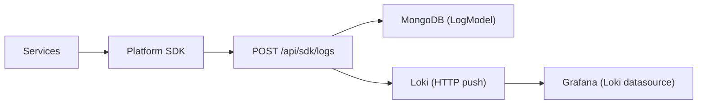

# Monitoring & Observability

The Platform observability stack collects metrics, logs, and traces from all services. It uses **Grafana** for visualization, **Loki** for log aggregation, and **Prometheus** for metric collection — deployed via the `kube-prometheus-stack` Helm chart.

---

## Grafana Dashboards

Grafana is deployed in the `monitoring` namespace and configured with OIDC SSO (see [OIDC/SSO](./authentication.md#oidcsso)).

### Pre-Configured Dashboards

| Dashboard | Source | Description |
|---|---|---|
| **Platform Overview** | Prometheus + Loki | Cluster-wide view: pod health, resource usage, error rates |
| **API Performance** | `ApiMetric` MongoDB collection | p50/p95/p99 latency per route, 4xx/5xx rates, RPM |
| **Service Health** | SDK heartbeats | Service registration status, last seen, DB connection health |
| **Database Metrics** | Prometheus (exporters) | PostgreSQL queries/s, MongoDB ops, Redis hit rates |
| **Preview Environments** | Deployment records | Active preview counts, age distribution, decay stats |

### Access

```
https://{DOMAIN}/grafana/
```

Grafana is configured with OAuth2 proxy authentication. Users are automatically provisioned based on their Platform role:

| Platform Role | Grafana Role |
|---|---|
| `admin` | Admin |
| `devops` | Admin |
| `tech_lead` | Editor |
| `developer` | Viewer |
| `viewer` | Viewer |

---

## Loki Log Aggregation

### Architecture



### Log Ingestion

The SDK forwards logs via `POST /api/sdk/logs` or `POST /api/logs/ingest`. The API:

1. Stores logs in MongoDB's `LogModel` collection
2. Forwards them to Loki via the `forwardToLoki()` function

```typescript
// platform/api/src/lib/lokilog.ts
export async function forwardToLoki(logs) {
  const streams = logs.map(log => ({
    stream: {
      project_id: log.projectId,
      environment_id: log.environmentId,
      service_name: log.serviceName,
      level: log.level,
    },
    values: [[String(Date.now() * 1e6), JSON.stringify(log)]],
  }));
  await axios.post(`${lokiUrl}/loki/api/v1/push`, { streams });
}
```

### Log Search

```http
GET /api/logs/search?projectId=<uuid>&environmentId=<uuid>&level=ERROR&search=timeout&limit=50&offset=0
```

| Parameter | Description |
|---|---|
| `projectId` | Filter by project (UUID or name) |
| `environmentId` | Filter by environment |
| `serviceName` | Filter by service name |
| `level` | Filter by log level (`INFO`, `WARN`, `ERROR`) |
| `search` | Full-text regex search in message field |
| `limit` | Results per page (default 50, max 1000) |
| `offset` | Pagination offset |

---

## Prometheus Metrics

Prometheus scrapes metrics from:

- **kube-state-metrics** — Cluster-level pod, node, and deployment metrics
- **kubelet / cAdvisor** — Container resource usage (CPU, memory, disk, network)
- **node-exporter** — Node-level metrics (disk I/O, network, load)
- **Platform API** — `/api/metrics` endpoint exposes application-level metrics
- **SDK Heartbeats** — Per-service CPU, memory, request counts, error rates

### Key Metrics

| Metric | Source | Type |
|---|---|---|
| `container_cpu_usage_seconds_total` | cAdvisor | Counter |
| `container_memory_working_set_bytes` | cAdvisor | Gauge |
| `kube_deployment_status_replicas_ready` | kube-state | Gauge |
| `node_load1` / `node_load5` / `node_load15` | node-exporter | Gauge |
| `node_filesystem_avail_bytes` | node-exporter | Gauge |

Retention: **30 days** (configured in `bootstrap.sh` via `prometheus.prometheusSpec.retention=30d`).

---

## API p50/p95/p99 Latency Tracking

The Platform SDK collects per-route latency metrics and sends them to the API:

```http
POST /api/sdk/api-metrics
Authorization: Bearer <sdk-token>
Content-Type: application/json

{
  "metrics": [
    {
      "route": "/api/users",
      "method": "GET",
      "statusCode": 200,
      "durationMs": 42,
      "environment": "production"
    }
  ]
}
```

### Aggregated Metrics

```http
GET /api/sdk/api-metrics?projectId=<uuid>&environment=production&from=2025-06-01&to=2025-06-21
```

Returns percentiles computed via MongoDB aggregation:

```json
{
  "metrics": [
    {
      "_id": { "route": "/api/users", "method": "GET" },
      "count": 1523,
      "avgDuration": 38.2,
      "p50": 32,
      "p95": 78,
      "p99": 245,
      "errors4xx": 12,
      "errors5xx": 0,
      "lastSeen": "2025-06-21T12:00:00Z"
    }
  ]
}
```

Percentiles are calculated by sorting durations and picking the element at the 50th/95th/99th percentile index:

```typescript
// platform/api/src/routes/sdk.ts:573-575
p50: { $arrayElemAt: ['$durations', { $floor: { $multiply: [0.50, { $size: '$durations' }] } }] },
p95: { $arrayElemAt: ['$durations', { $floor: { $multiply: [0.95, { $size: '$durations' }] } }] },
p99: { $arrayElemAt: ['$durations', { $floor: { $multiply: [0.99, { $size: '$durations' }] } }] },
```

---

## Alert Rules Configuration

### Creating Alert Rules

```http
POST /api/alerts
Authorization: Bearer <token>
Content-Type: application/json

{
  "projectId": "<uuid>",
  "severity": "warning",
  "config": {
    "metric": "cpuPct",
    "operator": ">",
    "threshold": 90
  }
}
```

### Supported Operators

| Operator | Meaning |
|---|---|
| `>` | Greater than threshold |
| `<` | Less than threshold |
| `==` | Equal to threshold |

### Severity Levels

| Severity | Color | Notification |
|---|---|---|
| `info` | Blue | Logged only |
| `warning` | Yellow | Email notification to tech_leads |
| `critical` | Red | Email + in-app notification |

### Alert Evaluation

```http
POST /api/alerts/evaluate
Authorization: Bearer <token>
Content-Type: application/json

{
  "projectId": "<uuid>",
  "metrics": {
    "cpuPct": 95,
    "memoryMb": 512,
    "errors5xx": 3
  }
}
```

Returns triggered alerts:

```json
{
  "evaluatedCount": 5,
  "triggered": [
    {
      "ruleId": "uuid",
      "metric": "cpuPct",
      "value": 95,
      "threshold": 90,
      "severity": "warning"
    }
  ]
}
```

### Predefined Alert Templates

| Template | Metric | Threshold | Severity |
|---|---|---|---|
| High CPU | `cpuPct` | `> 90` | warning |
| High Memory | `memoryMb` | `> 1024` | warning |
| Error Spike | `errors5xx` | `> 10` | critical |
| High Latency | `avgResponseMs` | `> 500` | warning |

### Dashboard Integration

Alert rules created via the API appear in the **Alerts** tab in the Portal and in the **Alert Rules** section of the Grafana dashboards. Grafana alerting requires separate configuration within the Grafana UI for Prometheus-based alerting.
