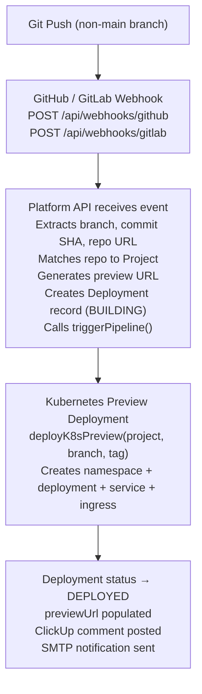

# Preview Environments

Preview environments are ephemeral deployments created automatically on every Git push to a non-main branch. They provide a full-stack preview URL with an isolated Kubernetes namespace, enabling developers and reviewers to test changes before merging.

---

## Deployment Pipeline



### Webhook Events

| Event | Action | Result |
|---|---|---|
| `push` (non-main branch) | Preview created/updated | New preview deployment |
| `push` (main/master) | Staging deployment triggered | GitLab pipeline + ArgoCD sync |
| `pull_request` opened/synchronized | Preview created/updated | Preview + ClickUp comment |
| `pull_request` closed (not merged) | Preview terminated | K8s resources cleaned up |
| `merge_request` open/update (GitLab) | Preview created/updated | Preview + ClickUp comment |
| `merge_request` close/merge (GitLab) | Preview terminated | K8s resources cleaned up |

---

## Preview URL Format

Preview URLs follow the pattern:

```
https://{project-slug}-{sanitized-branch}.preview.{DOMAIN}
```

```typescript
// platform/api/src/lib/preview.ts
export function generatePreviewUrl(branch, projectSlug, suffix) {
  const sanitized = branch
    .replace(/^(feature|fix|chore)\//i, '')
    .replace(/[^a-zA-Z0-9-]/g, '-')
    .toLowerCase();
  return `${projectSlug}-${sanitized}.preview.${suffix}`;
}
```

### Examples

| Branch | Project | Preview URL |
|---|---|---|
| `feature/CU-842-auth-fix` | `my-app` | `https://my-app-cu-842-auth-fix.preview.platform.example.com` |
| `fix/CU-123-upload-timeout` | `dashboard` | `https://dashboard-cu-123-upload-timeout.preview.platform.example.com` |
| `chore/deps-update` | `api-gateway` | `https://api-gateway-deps-update.preview.platform.example.com` |

### PR/MR Number Format

When triggered from a pull/merge request, metadata includes the PR/MR number:

```
https://{project-slug}-{sanitized-branch}.preview.{DOMAIN}
```

---

## 72-Hour TTL with PreviewDecayScheduler

Preview environments have a **maximum lifetime of 72 hours**. The `PreviewDecayScheduler` automatically cleans up expired environments.

### How It Works

```typescript
// platform/api/src/lib/preview-decay.ts
const PREVIEW_TTL_MS = 72 * 60 * 60 * 1000;    // 72 hours
const CHECK_INTERVAL_MS = 15 * 60 * 1000;       // Check every 15 minutes
```

1. **Startup** — The scheduler starts in `server.ts:57` via `startPreviewDecayScheduler()`
2. **Interval** — Every 15 minutes, the scheduler queries for stale preview deployments:
   - `environment_id` matches a preview environment
   - Status is `deployed`, `building`, or `deploying`
   - `created_at` is older than 72 hours
   - `preview_url` is not null
3. **Cleanup** — For each expired deployment:
   - `terminateK8sPreview(branch)` — removes K8s resources
   - Status set to `expired`
   - `terminatedAt` timestamp recorded
   - Metadata includes `decayReason: "72h-ttl-expired"`

```bash
# logs
[decay] Preview environment decay scheduler started (TTL: 72h, check: 15min)
[decay] Found 3 expired preview deployments
[decay] Expired preview: feature/CU-842-auth-fix (uuid)
```

### Configuration

| Parameter | File | Current Value |
|---|---|---|
| TTL | `preview-decay.ts:6` | 72 hours (259,200,000 ms) |
| Check interval | `preview-decay.ts:7` | 15 minutes (900,000 ms) |
| Initial delay | `preview-decay.ts:16` | 30 seconds |

---

## Environment Variables Per Preview

Each preview environment inherits the project's environment variables from the `ProjectConfig` and `Secret` entities, scoped to the `preview` environment.

Variables can be set per-preview by creating secrets with the preview environment's UUID:

```http
POST /api/projects/:projectId/secrets
{
  "key": "FEATURE_FLAG_NEW_UI",
  "value": "true",
  "environmentId": "<preview-environment-uuid>"
}
```

Preview-specific config values can also be set:

```http
POST /api/config
{
  "projectId": "...",
  "key": "LOG_LEVEL",
  "value": "debug",
  "environmentId": "<preview-environment-uuid>"
}
```

### SDK Injection in Previews

When a service runs in preview mode with the Platform SDK, the config endpoint automatically resolves the correct environment and injects the appropriate secrets:

```http
GET /api/sdk/config?projectId=<projectId>&environmentId=<preview-env-id>
```

---

## Manual Cleanup

```http
POST /api/deployments/:id/terminate
Authorization: Bearer <token>
```

This sets the deployment status to `TERMINATED`. K8s preview resources are cleaned up via the webhook flow when a PR/MR is closed.
