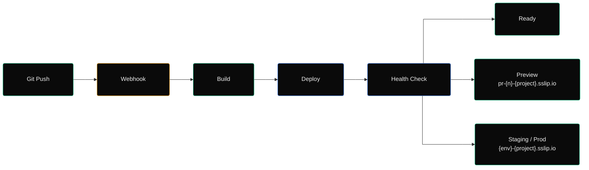
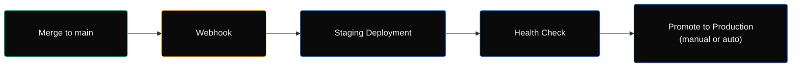

# Deploy Your App

Platform automates the deployment pipeline from Git push to production — with preview environments for every PR.

## The Pipeline



## 1. Push Code

Push to any branch in your Git repository. Platform listens for webhook events.

```bash
git checkout -b feature/new-api
git add .
git commit -m "Add new API endpoint"
git push origin feature/new-api
```

## 2. Webhook Triggers Deployment

The Git webhook (configured in Project Settings) sends a push event to the Platform API:

```
POST /api/webhooks/github
Content-Type: application/json

{
  "ref": "refs/heads/feature/new-api",
  "repository": { "clone_url": "https://github.com/your-org/my-app.git" },
  "commits": [{ "id": "abc123", "message": "Add new API endpoint" }]
}
```

## 3. Preview Environment

For non-`main` branches, Platform creates a **preview environment**:

- URL: `https://pr-{number}-{project}.sslip.io/`
- Isolated Kubernetes namespace
- Auto-cleanup when PR is closed or branch is deleted
- Accessible via `sslip.io` wildcard DNS — no DNS configuration needed

## 4. Merge to Main

When a PR is merged to `main`:



- **Staging** is deployed automatically on every `main` push
- **Production** can be manual (via Portal) or automatic (toggle in Environment Settings)

## 5. Monitor in Portal

Open the **Deployments** tab in your project to see:

| Column | Description |
|---|---|
| Commit | Git SHA with link to the commit |
| Branch | Source branch |
| Environment | dev, staging, production, or pr-{number} |
| Status | Queued → Building → Deploying → Healthy / Failed |
| Duration | Total time from build to healthy |
| Logs | Click to view real-time container logs |

## 6. Access Logs & Metrics

Each deployment has:

- **Logs** — Streamed via Loki, searchable in the Portal
- **Metrics** — Request rate, error rate, p50/p95/p99 latency, CPU, memory
- **Secrets** — Environment-specific encrypted configuration (viewable by authorized roles only)

## Preview Cleanup

Preview environments are automatically cleaned up:

| Trigger | Action |
|---|---|
| PR closed (merged) | Preview kept for 1 hour, then deleted |
| PR closed (unmerged) | Preview deleted immediately |
| Branch deleted | Preview deleted immediately |
| Age > 7 days | Scheduler marks for deletion |

## Configuration

Configure deployment settings per environment:

```bash
# Environment variables available during build
BUILD_CMD=npm run build
RUN_CMD=npm start
HEALTH_CHECK_PATH=/health
HEALTH_CHECK_TIMEOUT=30
REPLICAS=2
CONTAINER_PORT=3000
```

Set these in **Project → Environments → {env} → Settings**.

## Next Steps

- [Configure preview environments](../guides/preview-environments.md)
- [Set up production deployment](../deployment/bootstrap.md)
- [Monitor your application](../guides/monitoring.md)
